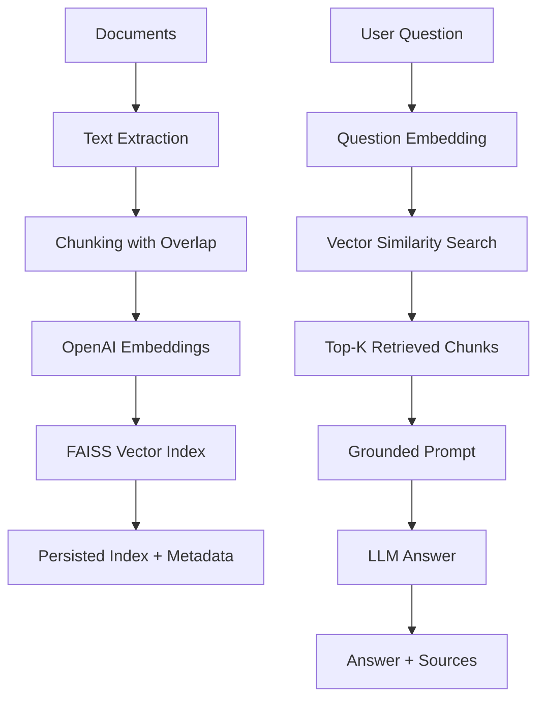
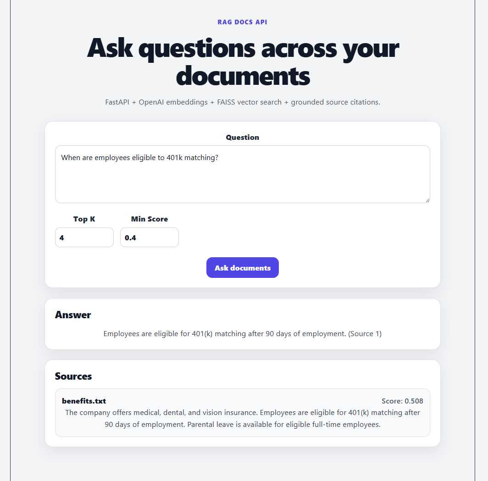
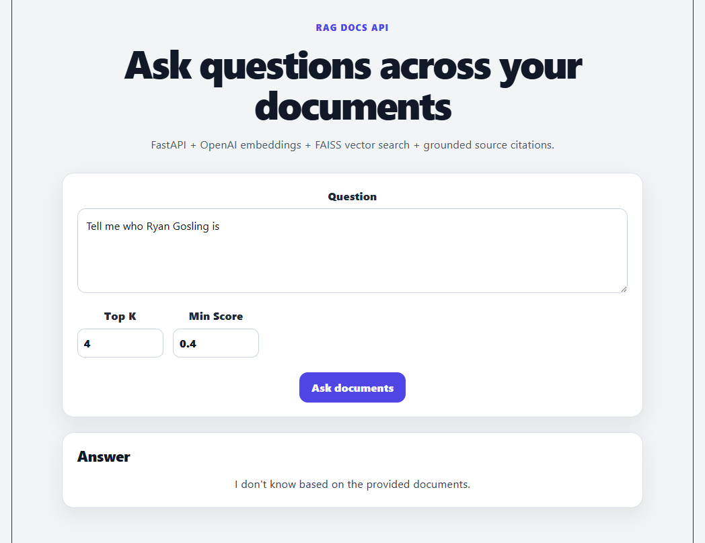
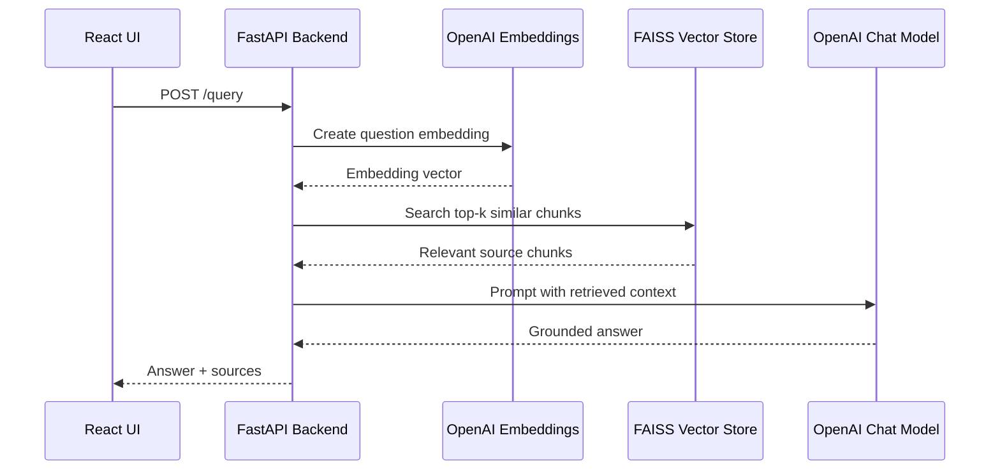

# RAG Docs API

A production-style Retrieval-Augmented Generation project built with **Python**, **FastAPI**, **OpenAI embeddings**, **FAISS**, **Docker**, and **React TypeScript**.

This project allows users to ingest documents, ask natural-language questions, and receive grounded answers with source citations.

---

## Features

- Multi-document ingestion
- `.txt` and `.pdf` document support
- Chunking with overlap
- OpenAI embedding generation
- FAISS vector search
- Similarity score filtering
- Grounded answer generation
- Source attribution with document names and scores
- Dockerized FastAPI backend
- React + TypeScript frontend
- Reset endpoint for clearing vector index

---

## Tech Stack

| Layer            | Technology                |
| ---------------- | ------------------------- |
| Backend API      | FastAPI                   |
| Language         | Python                    |
| Embeddings       | OpenAI Embeddings         |
| Vector Search    | FAISS                     |
| Frontend         | React + TypeScript + Vite |
| Containerization | Docker + Docker Compose   |

---

## Architecture







---

## Query Flow



---

## Project Structure

```text
rag-docs-api/
├─ app/
│  ├─ main.py
│  ├─ config.py
│  ├─ logging_config.py
│  ├─ models.py
│  └─ services/
│     ├─ chunking.py
│     ├─ embeddings.py
│     ├─ loaders.py
│     ├─ qa.py
│     └─ vector_store.py
├─ data/
│  ├─ raw/
│  └─ index/
├─ docs/
│  ├─ architecture.md
│  ├─ api.md
│  ├─ demo.md
│  └─ development.md
├─ ui/
│  └─ React TypeScript frontend
├─ Dockerfile
├─ docker-compose.yml
├─ requirements.txt
└─ README.md
```

---

## Environment Variables

Create a `.env` file in the project root:

```env
OPENAI_API_KEY=your_openai_api_key_here
OPENAI_EMBEDDING_MODEL=text-embedding-3-small
OPENAI_CHAT_MODEL=gpt-4.1-mini
```

Do not commit `.env`.

---

## Run with Docker

```bash
docker compose up --build
```

Backend runs at:

```text
http://127.0.0.1:8000
```

Health check:

```bash
curl http://127.0.0.1:8000/health
```

---

## Run UI

In a separate terminal:

```bash
cd ui
npm install
npm run dev
```

Frontend runs at:

```text
http://localhost:5173
```

---

## API Examples

### Health Check

```bash
curl http://127.0.0.1:8000/health
```

### Reset Vector Index

```bash
curl -X POST http://127.0.0.1:8000/reset-index
```

### Ingest Documents

```bash
curl -X POST http://127.0.0.1:8000/ingest \
  -H "Content-Type: application/json" \
  -d '{"file_paths": ["data/raw/company_policy.txt", "data/raw/benefits.txt"]}'
```

### Query Documents

```bash
curl -X POST http://127.0.0.1:8000/query \
  -H "Content-Type: application/json" \
  -d '{"question": "When are employees eligible for 401k matching?", "top_k": 4, "min_score": 0.4}'
```

Example response:

```json
{
  "answer": "Employees are eligible for 401(k) matching after 90 days of employment. (Source 1)",
  "sources": [
    {
      "doc_id": "benefits.txt",
      "chunk_id": "benefits.txt-chunk-0",
      "score": 0.438,
      "text": "The company offers medical, dental, and vision insurance..."
    }
  ]
}
```

---

## Design Tradeoffs

### FAISS for Vector Search

FAISS was chosen because it is lightweight, local-first, and easy to use for an MVP. It avoids external infrastructure while still demonstrating real vector retrieval.

### Character-Based Chunking

The project uses simple character-based chunking with overlap. This is easy to explain and works well for small documents. Token-based chunking would be a future improvement.

### Source-Aware Answers

The API returns both the generated answer and retrieved source chunks. This improves trust, debugging, and explainability.

### Reset Index Endpoint

Since FAISS does not make document-level updates as simple as database row updates, the project includes a `/reset-index` endpoint for clean re-ingestion during local development.

---

## Future Improvements

- Token-based chunking
- Document deduplication by hash or `chunk_id`
- Delete or update individual documents
- Hybrid search using keyword + vector retrieval
- Reranking retrieved chunks
- Streaming responses
- Upload documents from the UI
- Authentication
- Evaluation test set for retrieval quality
- Deployment to cloud infrastructure

---
