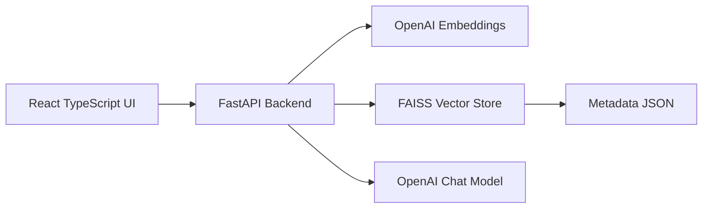
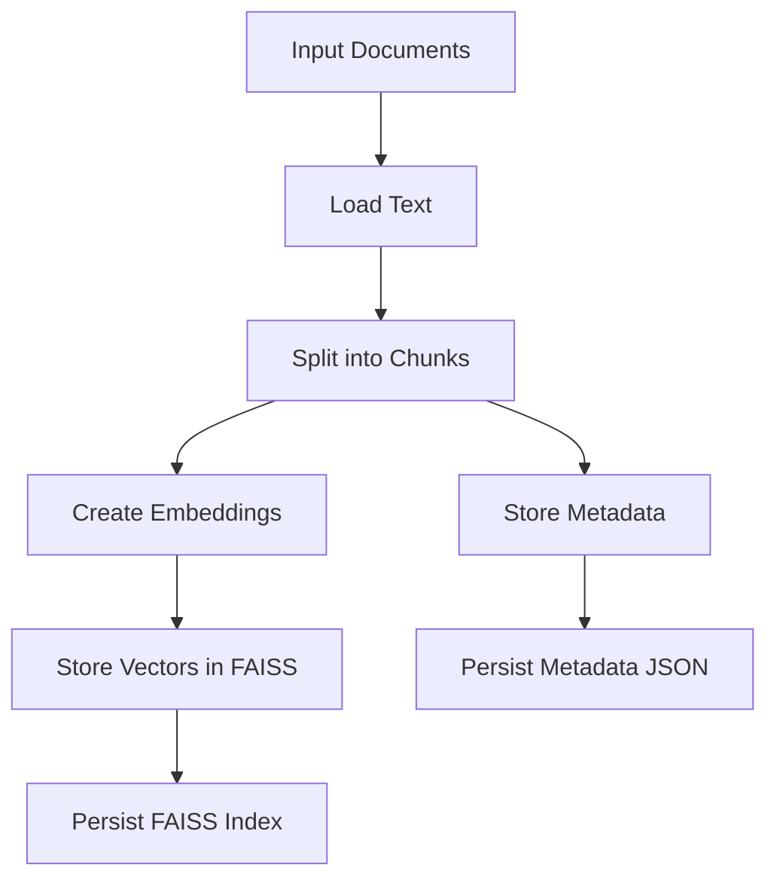
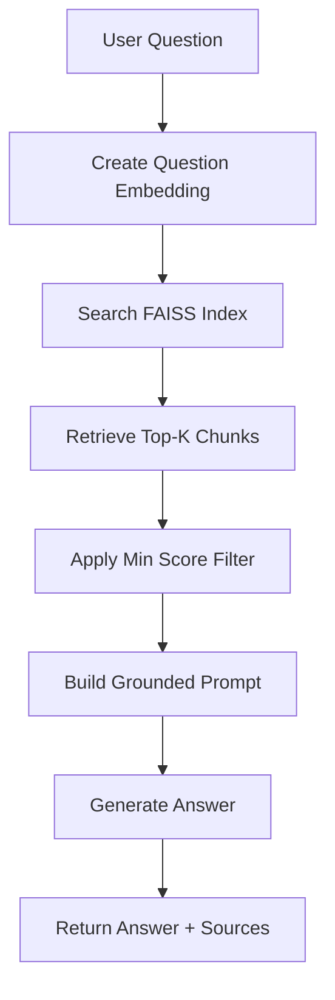
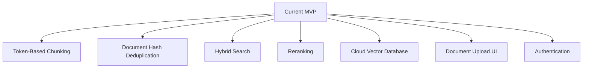

# Architecture

This project implements a Retrieval-Augmented Generation system with a separate indexing pipeline and query pipeline.

---

## High-Level System

---

## Indexing Pipeline

The indexing pipeline processes documents and stores them in a searchable vector index.

### Steps

1. User provides document file paths.
2. Backend loads `.txt` or `.pdf` content.
3. Text is split into overlapping chunks.
4. Each chunk is converted into an embedding vector.
5. Vectors are stored in FAISS.
6. Metadata is persisted separately for source attribution.

---

## Query Pipeline

The query pipeline retrieves relevant document chunks and uses them as context for answer generation.

---

## Important Components

### FastAPI

FastAPI exposes the REST API endpoints:

- `/health`
- `/ingest`
- `/query`
- `/reset-index`

### FAISS

FAISS stores normalized embedding vectors and performs similarity search.

The project uses inner product search with normalized vectors, which approximates cosine similarity.

### Metadata Store

FAISS stores vectors, but source metadata is stored separately in JSON.

Metadata includes:

- `doc_id`
- `chunk_id`
- `text`

### React UI

The React UI provides a simple interface for asking questions and viewing source chunks.

---

## Design Decisions

### Why separate metadata from FAISS?

FAISS is optimized for vector search, not document metadata management. Keeping metadata in JSON makes the project simple and transparent for an MVP.

### Why return source chunks?

Returning sources improves user trust and helps debug retrieval quality.

### Why add `/reset-index`?

During development, documents may be ingested multiple times. Resetting the index provides a clean way to remove duplicates and re-ingest documents.

---

## Future Architecture Improvements

